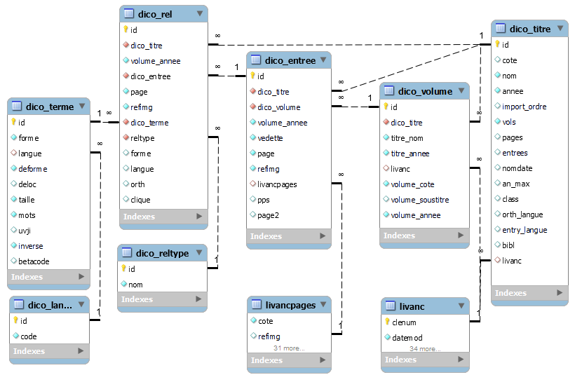

# BIU Santé / Médica / Métadictionnaire : base de données

Cet entrepôt contient le code et les données qui alimentent la base de données (MySQ)L du Métadictionnaire Médica. La génération est séparée de l’application web publique [medict](https://github.com/biusante/medict#readme) qui sert ces données. Il en résulte pour la sécurité que l’application ouverte sur l’extérieur est en lecture seule, qu’elle ne produit aucune données, et que ces données peuvent être produites en SSH sur le serveur, ou bien sur une autre machine, par exemple celle d’un administrateur.

## Requis

Un serveur MySQL **5.7**. Attention, très gros problème de performances avec **MySQL 8** (requêtes en timeout), cf. https://dev.mysql.com/doc/refman/8.0/en/known-issues.html. Aucun contournement n’a encore été trouvé.

PHP en ligne de commande, version récente (7.3+)
 * Windows, ajouter le chemin du programme php.exe dans son “[Path](https://www.php.net/manual/fr/faq.installation.php#faq.installation.addtopath)”
 * Linux, ajouter le paquet php ligne de commande de sa distribution, ex pour Debian : apt install php-cli

Modules PHP
  * pdo_mysql — connexion à la base de données
  * intl — pour normalisation du grec, [Normalizer](https://www.php.net/manual/fr/class.normalizer.php)
  * mbstring — traitement de chaînes unicode
  * xsl — xsltproc, pour transformations XML/TEI
  * zip — livraison finale, zipper les fichiers SQL


## Chargement rapide

Dans l’instance MySQL d’un serveur PHP, créer une base et un utilisateur pour le Métadictionnaire, charger les tables (schéma et données) au format SQL dans [data_sql/](data_sql/) (zippée pour PhpMyAdmin). 


## Génération des tables relationnelles

**Attention, la génération prend une vingtaine de minutes sur Windows, elle est plus longue sur linux, une approche plus rapide est en cours d’écriture.**

* Récupérer l’entrepôt des fichiers xml/tei des dictionnaires balisés finement
  <br/>`mes_source$ git clone https://github.com/biusante/medict_xml.git`
* Récupérer cet entrepôt
  <br/>`mes_source$ git clone https://github.com/biusante/medict_sql.git`
* Entrer dans le dossier de génération des données
  <br/>`mes_source$ cd medict_sql`
* Fournir ses paramètres (ex : connexion MySQL) en copiant [_pars.php](_pars.php) vers pars.php, et le renseigner
  <br/>`medict_sql$ cp _pars.php pars.php`
  <br/>`medict_sql$ vi pars.php`
* Lancer la génération des données avec le script [build.php](build.php)
  <br/>`medict_sql$ php build.php`
  <br/>Attendre une vingtaine de minutes à voir se charger les volumes (le premier, Littré 1873, prend 300 s.)
* retrouver les tables générées dans [data_sql/](data_sql/).

### Étapes 

1. Générer les données à partir de fichiers XML/TEI
2. Charger la table des titres qui pilote l’insertion [dico_titre.tsv](dico_titre.tsv)
3. Charger les éventuelles informations de volumes, pour les titres en plusieurs tomes [dico_volume.tsv](dico_volume.tsv)
4. Effacer toutes les données, notamment la table des mots indexés
5. Charger les volumes selon l’ordre défini dans [dico_titre.tsv](dico_titre.tsv)

### Erreurs rencontrées

```
$ php build.php
```

**Paramètres MySQL introuvables, attendus dans : ./pars.php cf. ./_pars.php medict_sql/php/Biusante/Medict/Util.php**

L’application ne trouve pas son fichier de paramétrage attendu dans pars.php.

**Undefined constant PDO::MYSQL_ATTR_INIT_COMMAND in medict_sql/php/Biusante/Medict/Util.php**

PHP n’a pas chargé l’extension pdo_mysql, cf. php.ini.  
```bash
Ubuntu 22.04$ sudo apt update
Ubuntu 22.04$ sudo apt install php-mysql
```

**PDOException: SQLSTATE[HY000] [2002] No such file or directory in medict_sql/php/Biusante/Medict/Util.php**

MySQL ne reconnaît pas ~~localhost~~ comme serveur. Vérifier pars.php
```php
return array(
    'host' => '127.0.0.1',
    // […]
)
```

**PDOException: SQLSTATE[HY000] [2002] Connection refused**

MySQL n’est pas, ou est mal, installé.
```bash
Ubuntu 22.04$ telnet 127.0.0.1 3306
Trying 127.0.0.1...
telnet: Unable to connect to remote host: Connection refused
ubuntu 22.04$ sudo sudo apt update
ubuntu 22.04$ sudo apt install mysql-server
ubuntu 22.04$ sudo service mysql start
ubuntu 22.04$ telnet 127.0.0.1 3306
Trying 127.0.0.1...
Connected to 127.0.0.1.
# demande un mot de passe, arrêter avec Ctrl+C
```

**PDOException: SQLSTATE[HY000] [1698] Access denied for user …**

MySQL ne connaît pas l’utilisateur déclaré dans votre fichier pars.php. Cet utilisateur a besoin de tous les droits de la base pour créer et remplir les tables (`GRANT ALL PRIVILEGES ON medict.*`), mais aussi du droit de pouvoir utiliser mysqldump (`GRANT PROCESS ON *.* TO …`).

```bash
Ubuntu 22.04$ sudo mysql
mysql> CREATE DATABASE medict;
Query OK, 1 row affected (0.02 sec)

mysql> CREATE USER 'medict_sql'@'localhost' IDENTIFIED BY 'MotDePasseSuperSecret';
Query OK, 0 rows affected (0.02 sec)

mysql> GRANT ALL PRIVILEGES ON medict.* TO 'medict_sql'@'localhost';
Query OK, 0 rows affected (0.02 sec)

mysql> GRANT PROCESS ON *.* TO 'medict_sql'@'localhost';
Query OK, 0 rows affected (0.02 sec)

mysql> FLUSH PRIVILEGES;
```

**PDOException: SQLSTATE[HY000] [1044] Access denied for user 'medict_sql'@'localhost' to database 'medict' in medict_sql/php/Biusante/Medict/Util.php**

L’utilisateur n’a pas les droits pour se connecter à la base de données : `mysql> GRANT ALL ON medict.* TO 'medict_sql'@'localhost';`

**PDOException: SQLSTATE[HY000] [1049] Unknown database 'medict' in medict_sql/php/Biusante/Medict/Util.php**

La base de données n’existe pas : `mysql> CREATE DATABASE medict;`

**PDOException: SQLSTATE[42S02]: Base table or view not found: 1146 Table 'medict.dico_terme' doesn't exist in medict_sql/php/Biusante/Medict/Insert.php**

Ne devrait pas arriver, build.php crée les tables et les index si nécessaire.

**\[insert_volume\] 37020d… PHP Fatal error:  Uncaught Exception: Impossible to load medict_sql/php/Normalizer.php in medict_sql/php/autoload.php**

L’extention php intl n’est pas installée.

```bash
ubuntu 22.04$ sudo apt-get install php-intl
```

**Call to undefined function Biusante\Medict\mb_internal_encoding() in medict_sql/php/Biusante/Medict/Util.php**

L’extension php mbstring n’est pas installée.

```bash
ubuntu 22.04$ sudo apt-get install php-mbstring
```

**Uncaught Exception: Impossible to load medict_sql/php/DOMDocument.php in medict_sql/php/autoload.php**

Les extensions php xml et xsl ne sont pas installées.

```bash
ubuntu 22.04$ sudo apt-get install php-xml
```

## Arbre des fichiers

* [data_sql/](data_sql/) — GÉNÉRÉ, données SQL directement importable dans une base de données MySQL, par exemple avec PhpMySql.
* [pars.php](pars.php) — MODIFIABLE, fichier obligatoire à créer avec les paramètre de connexion et des chemins, sur le modèle de [_pars.php](_pars.php).
* [build.php](build.php) — script de génération de la totalité des données.
* [dico_titre.tsv](dico_titre.tsv) — MODIFIABLE, données bibliographiques par titre, copier dans la base de données, utilisé dans l’application.
* [dico_volume.tsv](dico_volume.tsv) — MODIFIABLE, données bibliographiques pour titres de plus d’un volume.
* [data_events/](data_events/) — MODIFIABLE et GÉNÉRÉ (pour les sources xml/tei). Ces fichiers partagent un même format, qu’ils proviennent de l’ancienne base Médica, ou des dictionnaires indexés finement en XML/TEI [medict-xml/xml](https://github.com/biusante/medict-xml/tree/main/xml). Les données anciennes peuvent être corrigées dans ces fichiers. De nouvelles données peuvent être produites dans ce format.
* [exports/](exports/) — GÉNÉRÉ, des fichiers qui ont été demandé pour une vue sur les données.
* [medict.mwb](medict.mwb), schéma de la base de données au format [MySQL Workbench](https://www.mysql.com/products/workbench/) utilisé comme source du code SQL.
* [doc/](doc/) — documentation, documents de l’équipe et de recherche, et surtout.
* [anc_sql/](anc_sql/) — ARCHIVÉ, export SQL des données de la base orginale Médica, laissé pour mémoire.
* [anc_tsv/](anc_tsv/) — ARCHIVÉ, données récupérées de la base orginale Médica, 1 fichier par volume, dans leur structure initiale (une ligne par page avec les titres structurants, généralement, les vedettes). Ces données sont archivées pour mémoire, leur traitement a été poussé le plus loin possible avec [Biusante\Medict\Anc](php/Biusante/Medict/Anc.php) pour alimenter [data_events/](data_events/).
* .gitattributes, .gitignore, README.md — fichiers git


## Schéma de la base de données

Le schéma peut être éclairé par le format de fichier qui y rentre, cf. [data_events/](data_events#readme)

La partie délicate du modèle de données concerne les relations de traductions et surtout de mots liés, aussi va-t-on décrire ce schéma en commençant par les plus petits éléments, les mots. Tout _mot_ (vedette, locution, traduction, renvoi…) est enregistré de manière unique dans la table `dico_terme`, avec sa forme graphique et sa langue. Les termes sont dédoublonnés selon une clé `dico_terme.deforme` (lettres minuscules sans accents, traitements particuliers selon les langues pour : œ, æ, -, i/j, u/v…). Une vedette est une relation (table `dico_rel`) entre un _mot_ (`dico_term`) et un _article_ (`dico_entree`) de type _orth_ (`<orth>` selon la nomenclature TEI, `dico_rel.reltype = 1`). Une traduction est une relation de type _foreign_, le regroupement des traductions avec les vedettes se fait sur tout l’article (`dico_rel.dico_entreee`). Un renvoi est une relation de type _clique_, le regroupement des mots d’une clique se fait sur un identifiant spécifique (`dico_rel.clique`) permettant à un même article de contenir plusieurs _cliques_ sémantiques (par exemple groupées selon les balises `<sense>`). Les tables `dico_volume` et `dico_titre` portent les informations bibliographiques renseignées par l’équipe scientifique dans les fichiers [dico_titre.tsv](dico_titre.tsv) et [dico_volume.tsv](dico_volume.tsv).

Dans un scénario habituel de requête, l’utilisateur cherche des lettres (dans `dico_terme.deforme`), les vedettes proposées sont tirées des relations _orth_ et _term_ (pour vedettes principales et secondaires, `dico_rel.reltype`) et sont filtrées par titres d’ouvrages (`dico_rel.dico_titre`). Les filtrages par dates ou type d’ouvrages (médecine, vétérinaire, pharmacie, glossaire…) sont ramenés à une liste d’identifiants de titre. Quand une vedette est sélectionnée (`dico_terme.id`), sont affichées les entrées qui ont cette vedette, avec les informations bibliographiques nécessaires (`dico_rel.dico_terme` -> `dico_rel.dico_entree` -> `dico_entree.id` -> `dico_entree.dico_volume` -> `dico_volume.id`). Pour afficher les traductions d’un mot sélectionné (`dico_terme.id`) ; sélectionner toutes les entrées (`dico_rel.dico_entree`) qui contiennent ce mot (`dico_rel.dico_terme`) dans une relation de traduction (`dico_rel.reltype`) ; reprendre cette liste d’entrées, et afficher la liste des traductions qu’elles contiennent en ordre alphabétique. Le principe des _mots liés_ est similaire, à la réserve que la clé de regroupement n’est plus l’_entrée_, mais la _clique_ (`dico_rel.clique`). Pour afficher les mots liés d’un mot sélectionné (`dico_terme.id`) ; sélectionner toutes les cliques (`dico_rel.clique`) qui contiennent ce mot (`dico_rel.dico_terme`) dans une relation de _clique_ (`dico_rel.reltype`) ; lister ensuite les mots de ces cliques.



```sql
CREATE TABLE IF NOT EXISTS `dico_terme` (
  `id` MEDIUMINT UNSIGNED NOT NULL AUTO_INCREMENT COMMENT 'Clé prinaire incrémentée automatiquement',
  `forme` VARCHAR(1024) NOT NULL COMMENT 'Forme affichable originale (accents et majuscules)',
  `langue` TINYINT UNSIGNED NULL COMMENT 'N° langue du terme',
  `deforme` VARCHAR(512) NOT NULL COMMENT 'Clé identifiante, minuscules sans accents',
  `deloc` VARCHAR(512) NULL COMMENT 'Pour recherche dans les locutions, minuscules latines sans accents',
  `taille` SMALLINT UNSIGNED NOT NULL COMMENT 'Taille du terme en caractères',
  `mots` TINYINT UNSIGNED NOT NULL COMMENT 'Nombre de mots pleins dans le terme',
  `betacode` VARCHAR(512) NULL COMMENT 'Forme grecque, version désaccentuée',
  PRIMARY KEY (`id`),
  INDEX `dico_lang` (`langue` ASC),
  FULLTEXT INDEX `locutable` (`deloc`),
  INDEX `lookup` (`deforme` ASC, `langue` ASC),
  INDEX `taille` (`taille` ASC),
  INDEX `sortable` (`deforme` ASC),
  INDEX `volet_trad` (`langue` ASC, `deforme` ASC),
  CONSTRAINT `dico_lang1`
    FOREIGN KEY (`langue`)
    REFERENCES `dico_langue` (`id`)
    ON DELETE NO ACTION
    ON UPDATE NO ACTION)
ENGINE = InnoDB
AUTO_INCREMENT = 406008
DEFAULT CHARACTER SET = utf8
COMMENT = 'Index de termes de tous types (vedettes, locutions, traductions, renvois…). 
La table est en InnoDB parce que la configuration par défaut des index plein texte y est moins contraignante qu’en MyISAM.'
PACK_KEYS = 1;

CREATE TABLE IF NOT EXISTS `dico_rel` (
  `id` MEDIUMINT UNSIGNED NOT NULL AUTO_INCREMENT COMMENT 'Clé principale auto',
  `dico_titre` SMALLINT UNSIGNED NOT NULL COMMENT 'Clé titre dictionnaire, nécessaire pour filtrage efficace.',
  `volume_annee` SMALLINT UNSIGNED NOT NULL COMMENT 'Année de publication du volume, pour tri, redondance dico_volume',
  `dico_entree` MEDIUMINT UNSIGNED NOT NULL COMMENT 'Article source de la relation',
  `page` CHAR(16) NOT NULL COMMENT 'N° de page où figure  la relation, ',
  `refimg` SMALLINT UNSIGNED NOT NULL COMMENT 'No séquentiel d’image de la page, en paramètre d’url',
  `dico_terme` MEDIUMINT UNSIGNED NOT NULL COMMENT 'Forme graphique et langue du terme lié',
  `reltype` TINYINT UNSIGNED NOT NULL COMMENT 'Type de relation (vedette, suggestion, traduction…)',
  `orth` TINYINT NULL COMMENT 'Si vedette dans une clique, un drapeau pour ne pas prendre cette relation dans un groupe',
  `clique` INT UNSIGNED NULL COMMENT 'Clé de regroupement de plusieurs termes dans cette relation',
  PRIMARY KEY (`id`),
  INDEX `dico_entree` (`dico_entree` ASC),
  INDEX `dico_titre` (`dico_titre` ASC),
  INDEX `dico_reltype` (`reltype` ASC),
  INDEX `dico_terme` (`dico_terme` ASC),
  INDEX `volet_index` (`dico_terme` ASC, `dico_titre` ASC, `reltype` ASC, `orth` ASC, `dico_entree` ASC),
  INDEX `volet_entree` (`dico_terme` ASC, `reltype` ASC, `dico_titre` ASC, `volume_annee` ASC, `dico_entree` ASC),
  INDEX `volet_trad` (`dico_terme` ASC, `reltype` ASC, `volume_annee` ASC, `dico_entree` ASC),
  INDEX `volet_sugg1` (`reltype` ASC, `dico_terme` ASC, `clique` ASC, `volume_annee` ASC, `refimg` ASC),
  INDEX `clique` (`clique` ASC, `reltype` ASC, `dico_terme` ASC))
ENGINE = MyISAM
DEFAULT CHARACTER SET = utf8
COMMENT = 'Relation typée entre un terme et une entrée. ';


CREATE TABLE IF NOT EXISTS `dico_volume` (
  `id` SMALLINT UNSIGNED NOT NULL AUTO_INCREMENT COMMENT 'Clé prinaire incrémentée automatiquement',
  `dico_titre` SMALLINT UNSIGNED NOT NULL COMMENT 'Lien au dictionnaire source',
  `titre_nom` VARCHAR(255) NOT NULL COMMENT 'Titre, nom court, redondance dico_titre',
  `titre_annee` SMALLINT UNSIGNED NOT NULL COMMENT 'Titre, année, redondance dico_titre',
  `livanc` INT UNSIGNED NULL DEFAULT NULL COMMENT 'Lien à la tabéle livanc',
  `volume_cote` VARCHAR(32) NOT NULL COMMENT 'Volume, cote, nécessaire pour construire url',
  `volume_soustitre` VARCHAR(255) NULL DEFAULT NULL COMMENT 'Volume, partie du titre à ajouter à propos du volume',
  `volume_annee` SMALLINT UNSIGNED NOT NULL COMMENT 'Volume, année de publication',
  PRIMARY KEY (`id`),
  INDEX `dico_titre` (`dico_titre` ASC),
  INDEX `livanc` (`livanc` ASC),
  INDEX `cote` (`volume_cote` ASC))
ENGINE = MyISAM
AUTO_INCREMENT = 385345
DEFAULT CHARACTER SET = utf8
COMMENT = 'Volume, informations suffisant à construire une référence bibliographique (sans n° de page)'
PACK_KEYS = 1;


CREATE TABLE IF NOT EXISTS `dico_entree` (
  `id` MEDIUMINT UNSIGNED NOT NULL AUTO_INCREMENT COMMENT 'Clé prinaire incrémentée automatiquement',
  `dico_titre` SMALLINT UNSIGNED NOT NULL COMMENT 'Lien au titre source',
  `dico_volume` SMALLINT UNSIGNED NOT NULL COMMENT 'Lien à la table de volume (pour ref biblio)',
  `volume_annee` SMALLINT UNSIGNED NOT NULL COMMENT 'Volume, année de publication, nécessaire pour tri, redondance dico_volume',
  `vedette` TEXT NOT NULL COMMENT 'Un ou plusieurs mots en vedette identifiant l’article dans l’ordre alphabétique de l’ouvrage',
  `page` VARCHAR(32) NOT NULL COMMENT 'Page de début de l’entrée',
  `refimg` SMALLINT UNSIGNED NOT NULL COMMENT 'No d’image en paramètre d’url',
  `livancpages` INT UNSIGNED NULL DEFAULT NULL COMMENT 'Lien à la table des pages',
  `pps` SMALLINT UNSIGNED NULL DEFAULT NULL COMMENT 'Nombre de saut de pages dans l’article',
  `page2` VARCHAR(32) NULL DEFAULT NULL COMMENT 'Page de fin de l’entrée si différente du début',
  PRIMARY KEY (`id`),
  INDEX `livancpages` (`livancpages` ASC),
  INDEX `vedette` (`vedette`(100) ASC),
  INDEX `dico_volume` (`dico_volume` ASC),
  INDEX `dico_titre` (`dico_titre` ASC))
ENGINE = MyISAM
AUTO_INCREMENT = 385345
DEFAULT CHARACTER SET = utf8
COMMENT = 'Entrée dans un ouvrage, liée à la page de la vedette  (volet entrées de l’interface)'
PACK_KEYS = 1;


CREATE TABLE IF NOT EXISTS `dico_titre` (
  `id` SMALLINT UNSIGNED NOT NULL AUTO_INCREMENT COMMENT 'Clé prinaire incrémentée automatiquement',
  `cote` VARCHAR(32) NULL DEFAULT NULL COMMENT 'Cote du dictionnaire',
  `nom` VARCHAR(255) NOT NULL COMMENT 'Nom court du dictionnaire, affichable',
  `annee` SMALLINT(6) UNSIGNED NOT NULL COMMENT 'Date de parution du premier volume (clé de tri)',
  `import_ordre` SMALLINT UNSIGNED NULL COMMENT 'Numéro d’ordre pour l’import (priorité aux vedettes récentes et relues)',
  `vols` SMALLINT(6) NOT NULL DEFAULT '1' COMMENT 'Nombre de volumes',
  `pages` MEDIUMINT(9) NULL DEFAULT NULL COMMENT 'Nombre de pages',
  `entrees` MEDIUMINT(9) NULL DEFAULT NULL COMMENT 'Nombre d’entrées',
  `nomdate` VARCHAR(255) NULL DEFAULT NULL COMMENT 'Nom alternatif (avec date)',
  `an_max` SMALLINT(6) UNSIGNED NULL DEFAULT NULL COMMENT 'Date de parution du dernier volume si plusieurs sur plusieurs années',
  `class` VARCHAR(255) NULL DEFAULT NULL COMMENT 'Type de dictionnaire, mots clés séparés d’espaces, utilisés dans le formulaire de sélection des titres',
  `orth_langue` CHAR(3) NULL DEFAULT NULL COMMENT 'Code de langue des vedettes si différentes du français (la, grc), 1 cas \"fr,la\" pharma_019128',
  `entry_langue` CHAR(3) NULL DEFAULT NULL COMMENT 'Code langue des articles si différent du français (James en, la)',
  `bibl` TEXT NULL COMMENT 'Ligne bibliographique ISBD',
  `livanc` INT UNSIGNED NULL DEFAULT NULL COMMENT 'Clé dans la table livanc',
  PRIMARY KEY (`id`),
  INDEX `livanc` (`livanc` ASC),
  INDEX `import` (`import_ordre` ASC, `annee` ASC))
ENGINE = MyISAM
AUTO_INCREMENT = 52
DEFAULT CHARACTER SET = utf8
COMMENT = 'Table des titres des dictionnaires (pouvant concerner plusieurs volumes),  avec informations spéciales dico';
```

## ordre d’insertion

L’ordre d’insertion des dictionnaires est significatif, car chaque mot entré renseigne un dictionnaire partagé ; or les graphies sont inégalement précises 
selon l’âge des données (ex : les accents). On commence donc par les dictionnaires indexés finement (avec le plus de données, donc les plus longs à charger),
ensuite en ordre chronologiqure du plus récent au plus ancien. Cet ordre est piloté par [dico_titre.tsv](dico_titre.tsv), selon la colonne **import_ordre** (1 = premier, 10 = après), puis **annee** (le plus récent réputé le plus exact).

~~~~
[insert_titre] 37020d (1873) <u>Littré</u> <u>Robin</u> 13e éd.
[insert_volume] 37020d… …314.128 s.
[insert_titre] 37020d~lat (1873) <u>Littré</u> <u>Robin</u> 13e éd. Gloss. lat.
[insert_volume] 37020d~lat… …13.214 s.
[insert_titre] 37020d~grc (1873) <u>Littré</u> <u>Robin</u> 13e éd. Gloss. gr.
[insert_volume] 37020d~grc… …8.188 s.
[insert_titre] 37020d~deu (1873) <u>Littré</u> <u>Robin</u> 13e éd. Gloss. all.
[insert_volume] 37020d~deu… …20.769 s.
[insert_titre] 37020d~eng (1873) <u>Littré</u> <u>Robin</u> 13e éd. Gloss. angl.
[insert_volume] 37020d~eng… …10.270 s.
[insert_titre] 37020d~ita (1873) <u>Littré</u> <u>Robin</u> 13e éd. Gloss. ital.
[insert_volume] 37020d~ita… …17.729 s.
[insert_titre] 37020d~spa (1873) <u>Littré</u> <u>Robin</u> 13e éd. Gloss. esp.
[insert_volume] 37020d~spa… …18.981 s.
[insert_titre] 27898 (1908) <u>Littré</u> <u>Gilbert</u> 21e éd.
[insert_volume] 27898… …89.964 s.
[insert_titre] 269035 (1924) Larousse médical illustré
[insert_volume] 269035… …13.381 s.
[insert_titre] 26087 (1917) Larousse de guerre
[insert_volume] 26087… …0.884 s.
[insert_titre] pharma_p11247 (1914) <u>Vidal</u>
[insert_volume] pharma_p11247x1914… …1.893 s.
[insert_volume] pharma_p11247x1920… …1.583 s.
[insert_volume] pharma_p11247x1921… …1.104 s.
[insert_volume] pharma_p11247x1923… …2.448 s.
[insert_volume] pharma_p11247x1924… …1.442 s.
[insert_volume] pharma_p11247x1925… …1.064 s.
[insert_volume] pharma_p11247x1927… …2.167 s.
[insert_volume] pharma_p11247x1928… …1.917 s.
[insert_volume] pharma_p11247x1929… …1.890 s.
[insert_volume] pharma_p11247x1931… …2.525 s.
[insert_volume] pharma_p11247x1932… …5.674 s.
[insert_volume] pharma_p11247x1933… …5.137 s.
[insert_volume] pharma_p11247x1934… …4.368 s.
[insert_volume] pharma_p11247x1935… …4.464 s.
[insert_volume] pharma_p11247x1936… …5.450 s.
[insert_volume] pharma_p11247x1937… …5.231 s.
[insert_volume] pharma_p11247x1937suppl… …0.208 s.
[insert_volume] pharma_p11247x1938… …5.198 s.
[insert_volume] pharma_p11247x1939… …4.823 s.
[insert_volume] pharma_p11247x1940… …4.871 s.
[insert_volume] pharma_p11247x1943… …5.212 s.
[insert_titre] 24374 (1895) <u>Fage</u>
[insert_volume] 24374… …6.590 s.
[insert_titre] 21244 (1895) <u>Carnoy</u>
[insert_volume] 21244… …0.467 s.
[insert_titre] 56140 (1888) <u>Guilland</u>
[insert_volume] 56140… …4.426 s.
[insert_titre] 21575 (1887) <u>Labarthe</u>
[insert_volume] 21575x01… …2.950 s.
[insert_volume] 21575x02… …3.086 s.
[insert_titre] 20311 (1885) <u>Dechambre</u> & al. Dict. usuel
[insert_volume] 20311… …34.471 s.
[insert_titre] pharma_006061 (1883) <u>Dujardin-Beaumetz</u>
[insert_volume] pharma_006061x01… …4.103 s.
[insert_volume] pharma_006061x02… …1.286 s.
[insert_volume] pharma_006061x03… …2.073 s.
[insert_volume] pharma_006061x04… …3.672 s.
[insert_volume] pharma_006061x05… …4.105 s.
[insert_titre] 27518 (1867) <u>Bouchut</u> & <u>Després</u>
[insert_volume] 27518… …3.957 s.
[insert_titre] 37020c (1865) <u>Nysten</u> <u>Littré</u> <u>Robin</u> 12e éd.
[insert_volume] 37020c… …12.755 s.
[insert_titre] 32923 (1864) <u>Jaccoud</u>
[insert_volume] 32923x01… …0.158 s.
[insert_volume] 32923x02… …0.074 s.
[insert_volume] 32923x03… …0.083 s.
[insert_volume] 32923x04… …0.058 s.
[insert_volume] 32923x05… …0.092 s.
[insert_volume] 32923x06… …0.115 s.
[insert_volume] 32923x07… …0.070 s.
[insert_volume] 32923x08… …0.038 s.
[insert_volume] 32923x09… …0.073 s.
[insert_volume] 32923x10… …0.082 s.
[insert_volume] 32923x11… …0.075 s.
[insert_volume] 32923x12… …0.061 s.
[insert_volume] 32923x13… …0.062 s.
[insert_volume] 32923x14… …0.110 s.
[insert_volume] 32923x15… …0.047 s.
[insert_volume] 32923x16… …0.048 s.
[insert_volume] 32923x17… …0.075 s.
[insert_volume] 32923x18… …0.069 s.
[insert_volume] 32923x19… …0.090 s.
[insert_volume] 32923x20… …0.081 s.
[insert_volume] 32923x21… …0.068 s.
[insert_volume] 32923x22… …0.058 s.
[insert_volume] 32923x23… …0.062 s.
[insert_volume] 32923x24… …0.071 s.
[insert_volume] 32923x25… …0.041 s.
[insert_volume] 32923x26… …0.037 s.
[insert_volume] 32923x27… …0.034 s.
[insert_volume] 32923x28… …0.046 s.
[insert_volume] 32923x29… …0.042 s.
[insert_volume] 32923x30… …0.052 s.
[insert_volume] 32923x31… …0.025 s.
[insert_volume] 32923x32… …0.130 s.
[insert_volume] 32923x33… …0.096 s.
[insert_volume] 32923x34… …0.027 s.
[insert_volume] 32923x35… …0.046 s.
[insert_volume] 32923x36… …0.051 s.
[insert_volume] 32923x37… …0.033 s.
[insert_volume] 32923x38… …0.030 s.
[insert_volume] 32923x39… …0.053 s.
[insert_volume] 32923x40… …0.104 s.
[insert_titre] extbnfdechambre (1864) <u>Dechambre</u> & al.
[insert_volume] extbnfdechambrex001… …0.696 s.
[insert_volume] extbnfdechambrex002… …0.967 s.
[insert_volume] extbnfdechambrex003… …0.952 s.
[insert_volume] extbnfdechambrex004… …0.516 s.
[insert_volume] extbnfdechambrex005… …1.003 s.
[insert_volume] extbnfdechambrex006… …1.193 s.
[insert_volume] extbnfdechambrex007… …0.872 s.
[insert_volume] extbnfdechambrex008… …1.098 s.
[insert_volume] extbnfdechambrex009… …1.270 s.
[insert_volume] extbnfdechambrex010… …1.603 s.
[insert_volume] extbnfdechambrex011… …1.506 s.
[insert_volume] extbnfdechambrex012… …1.250 s.
[insert_volume] extbnfdechambrex013… …0.588 s.
[insert_volume] extbnfdechambrex014… …0.604 s.
[insert_volume] extbnfdechambrex015… …1.050 s.
[insert_volume] extbnfdechambrex016… …0.912 s.
[insert_volume] extbnfdechambrex017… …0.877 s.
[insert_volume] extbnfdechambrex018… …0.776 s.
[insert_volume] extbnfdechambrex019… …0.780 s.
[insert_volume] extbnfdechambrex020… …1.013 s.
[insert_volume] extbnfdechambrex021… …0.433 s.
[insert_volume] extbnfdechambrex022… …0.573 s.
[insert_volume] extbnfdechambrex023… …0.619 s.
[insert_volume] extbnfdechambrex024… …1.161 s.
[insert_volume] extbnfdechambrex025… …1.651 s.
[insert_volume] extbnfdechambrex026… …0.953 s.
[insert_volume] extbnfdechambrex027… …0.523 s.
[insert_volume] extbnfdechambrex028… …0.800 s.
[insert_volume] extbnfdechambrex029… …1.292 s.
[insert_volume] extbnfdechambrex030… …1.941 s.
[insert_volume] extbnfdechambrex031… …0.437 s.
[insert_volume] extbnfdechambrex032… …0.741 s.
[insert_volume] extbnfdechambrex033… …0.866 s.
[insert_volume] extbnfdechambrex034… …0.713 s.
[insert_volume] extbnfdechambrex035… …0.620 s.
[insert_volume] extbnfdechambrex036… …0.667 s.
[insert_volume] extbnfdechambrex037… …1.235 s.
[insert_volume] extbnfdechambrex038… …0.854 s.
[insert_volume] extbnfdechambrex039… …1.046 s.
[insert_volume] extbnfdechambrex040… …0.137 s.
[insert_volume] extbnfdechambrex041… …0.101 s.
[insert_volume] extbnfdechambrex042… …2.083 s.
[insert_volume] extbnfdechambrex043… …1.081 s.
[insert_volume] extbnfdechambrex044… …1.043 s.
[insert_volume] extbnfdechambrex045… …1.312 s.
[insert_volume] extbnfdechambrex046… …0.956 s.
[insert_volume] extbnfdechambrex047… …1.677 s.
[insert_volume] extbnfdechambrex048… …2.056 s.
[insert_volume] extbnfdechambrex049… …0.567 s.
[insert_volume] extbnfdechambrex050… …1.644 s.
[insert_volume] extbnfdechambrex051… …0.598 s.
[insert_volume] extbnfdechambrex052… …1.445 s.
[insert_volume] extbnfdechambrex053… …1.120 s.
[insert_volume] extbnfdechambrex054… …1.532 s.
[insert_volume] extbnfdechambrex055… …0.937 s.
[insert_volume] extbnfdechambrex056… …0.750 s.
[insert_volume] extbnfdechambrex057… …0.849 s.
[insert_volume] extbnfdechambrex058… …0.567 s.
[insert_volume] extbnfdechambrex059… …0.815 s.
[insert_volume] extbnfdechambrex060… …0.406 s.
[insert_volume] extbnfdechambrex061… …0.950 s.
[insert_volume] extbnfdechambrex062… …0.780 s.
[insert_volume] extbnfdechambrex063… …0.916 s.
[insert_volume] extbnfdechambrex064… …0.506 s.
[insert_volume] extbnfdechambrex065… …1.438 s.
[insert_volume] extbnfdechambrex066… …1.310 s.
[insert_volume] extbnfdechambrex067… …0.638 s.
[insert_volume] extbnfdechambrex068… …0.427 s.
[insert_volume] extbnfdechambrex069… …0.551 s.
[insert_volume] extbnfdechambrex070… …0.704 s.
[insert_volume] extbnfdechambrex071… …1.499 s.
[insert_volume] extbnfdechambrex072… …1.142 s.
[insert_volume] extbnfdechambrex073… …1.268 s.
[insert_volume] extbnfdechambrex074… …0.945 s.
[insert_volume] extbnfdechambrex075… …0.955 s.
[insert_volume] extbnfdechambrex076… …1.345 s.
[insert_volume] extbnfdechambrex077… …0.725 s.
[insert_volume] extbnfdechambrex078… …0.979 s.
[insert_volume] extbnfdechambrex079… …1.415 s.
[insert_volume] extbnfdechambrex080… …0.504 s.
[insert_volume] extbnfdechambrex081… …0.652 s.
[insert_volume] extbnfdechambrex082… …0.503 s.
[insert_volume] extbnfdechambrex083… …0.432 s.
[insert_volume] extbnfdechambrex084… …1.354 s.
[insert_volume] extbnfdechambrex085… …2.047 s.
[insert_volume] extbnfdechambrex086… …1.966 s.
[insert_volume] extbnfdechambrex087… …1.195 s.
[insert_volume] extbnfdechambrex088… …1.254 s.
[insert_volume] extbnfdechambrex089… …1.422 s.
[insert_volume] extbnfdechambrex090… …1.285 s.
[insert_volume] extbnfdechambrex091… …0.878 s.
[insert_volume] extbnfdechambrex092… …0.787 s.
[insert_volume] extbnfdechambrex093… …0.219 s.
[insert_volume] extbnfdechambrex094… …1.249 s.
[insert_volume] extbnfdechambrex095… …1.057 s.
[insert_volume] extbnfdechambrex096… …2.077 s.
[insert_volume] extbnfdechambrex097… …1.382 s.
[insert_volume] extbnfdechambrex098… …0.889 s.
[insert_volume] extbnfdechambrex099… …0.987 s.
[insert_volume] extbnfdechambrex100… …1.629 s.
[insert_titre] pharma_014236 (1859) <u>Roussel</u>
[insert_volume] pharma_014236x01… …1.527 s.
[insert_volume] pharma_014236x02… …1.855 s.
[insert_volume] pharma_014236x03… …2.088 s.
[insert_volume] pharma_014236x04… …2.999 s.
[insert_volume] pharma_014236x05… …3.483 s.
[insert_titre] extbnfpoujol (1857) <u>Poujol</u>
[insert_volume] extbnfpoujol… …0.869 s.
[insert_titre] 34823 (1856) <u>Bouley</u> & <u>Reynal</u>
[insert_volume] 34823x01… …0.905 s.
[insert_volume] 34823x02… …1.378 s.
[insert_volume] 34823x03… …0.720 s.
[insert_volume] 34823x04… …0.493 s.
[insert_volume] 34823x05… …0.529 s.
[insert_volume] 34823x06… …0.560 s.
[insert_volume] 34823x07… …0.703 s.
[insert_volume] 34823x08… …0.908 s.
[insert_volume] 34823x09… …0.418 s.
[insert_volume] 34823x10… …0.470 s.
[insert_volume] 34823x11… …0.849 s.
[insert_volume] 34823x12… …1.016 s.
[insert_volume] 34823x13… …0.367 s.
[insert_volume] 34823x14… …0.326 s.
[insert_volume] 34823x15… …0.470 s.
[insert_volume] 34823x16… …0.468 s.
[insert_volume] 34823x17… …0.183 s.
[insert_volume] 34823x18… …0.137 s.
[insert_volume] 34823x19… …0.486 s.
[insert_volume] 34823x20… …0.624 s.
[insert_volume] 34823x21… …1.054 s.
[insert_volume] 34823x22… …0.855 s.
[insert_titre] 37020b (1855) <u>Nysten</u> <u>Littré</u> <u>Robin</u> 10e éd.
[insert_volume] 37020b… …15.263 s.
[insert_titre] 37029 (1850) <u>Fabre</u>
[insert_volume] 37029x01… …0.166 s.
[insert_volume] 37029x02… …0.110 s.
[insert_volume] 37029x03… …0.096 s.
[insert_volume] 37029x04… …0.110 s.
[insert_volume] 37029x05… …0.153 s.
[insert_volume] 37029x06… …0.130 s.
[insert_volume] 37029x07… …0.116 s.
[insert_volume] 37029x08… …0.070 s.
[insert_volume] 37029xsup… …0.129 s.
[insert_titre] extbnfbeaude (1849) <u>Beaude</u>
[insert_volume] extbnfbeaudex01… …8.217 s.
[insert_volume] extbnfbeaudex02… …13.012 s.
[insert_titre] extalfodarboval (1838) <u>Hurtrel d’Arboval</u> 2e éd.
[insert_volume] extalfodarbovalx01… …1.037 s.
[insert_volume] extalfodarbovalx02… …1.359 s.
[insert_volume] extalfodarbovalx03… …1.005 s.
[insert_volume] extalfodarbovalx04… …0.769 s.
[insert_volume] extalfodarbovalx05… …1.017 s.
[insert_volume] extalfodarbovalx06… …0.646 s.
[insert_titre] extbnfnysten (1833) <u>Nysten</u> <u>Bricheteau</u> 5e éd.
[insert_volume] extbnfnysten… …9.849 s.
[insert_titre] 34820 (1832) <u>Adelon</u> & al. 2e éd.
[insert_volume] 34820x01… …0.116 s.
[insert_volume] 34820x02… …0.080 s.
[insert_volume] 34820x03… …0.050 s.
[insert_volume] 34820x04… …0.089 s.
[insert_volume] 34820x05… …0.086 s.
[insert_volume] 34820x06… …0.080 s.
[insert_volume] 34820x07… …0.087 s.
[insert_volume] 34820x08… …0.123 s.
[insert_volume] 34820x09… …0.074 s.
[insert_volume] 34820x10… …0.071 s.
[insert_volume] 34820x11… …0.047 s.
[insert_volume] 34820x12… …0.081 s.
[insert_volume] 34820x13… …0.046 s.
[insert_volume] 34820x14… …0.057 s.
[insert_volume] 34820x15… …0.042 s.
[insert_volume] 34820x16… …0.041 s.
[insert_volume] 34820x17… …0.047 s.
[insert_volume] 34820x18… …0.067 s.
[insert_volume] 34820x19… …0.047 s.
[insert_volume] 34820x20… …0.069 s.
[insert_volume] 34820x21… …0.029 s.
[insert_volume] 34820x22… …0.039 s.
[insert_volume] 34820x23… …0.047 s.
[insert_volume] 34820x24… …0.028 s.
[insert_volume] 34820x25… …0.038 s.
[insert_volume] 34820x26… …0.052 s.
[insert_volume] 34820x27… …0.046 s.
[insert_volume] 34820x28… …0.110 s.
[insert_volume] 34820x29… …0.090 s.
[insert_volume] 34820x30… …0.119 s.
[insert_titre] 57503 (1829) <u>Coster</u>
[insert_volume] 57503… …2.624 s.
[insert_titre] 34826 (1829) <u>Andral</u> & al.
[insert_volume] 34826x01… …0.164 s.
[insert_volume] 34826x02… …0.081 s.
[insert_volume] 34826x03… …0.259 s.
[insert_volume] 34826x04… …0.100 s.
[insert_volume] 34826x05… …0.154 s.
[insert_volume] 34826x06… …0.126 s.
[insert_volume] 34826x07… …0.078 s.
[insert_volume] 34826x08… …0.043 s.
[insert_volume] 34826x09… …0.116 s.
[insert_volume] 34826x10… …0.109 s.
[insert_volume] 34826x11… …0.138 s.
[insert_volume] 34826x12… …0.178 s.
[insert_volume] 34826x13… …0.132 s.
[insert_volume] 34826x14… …0.138 s.
[insert_volume] 34826x15… …0.174 s.
[insert_titre] pharma_014023 (1829) <u>Mérat</u> & <u>de Lens</u>
[insert_volume] pharma_014023x01… …12.276 s.
[insert_volume] pharma_014023x02… …15.048 s.
[insert_volume] pharma_014023x03… …21.241 s.
[insert_volume] pharma_014023x04… …13.937 s.
[insert_volume] pharma_014023x05… …10.680 s.
[insert_volume] pharma_014023x06… …26.473 s.
[insert_volume] pharma_014023x07… …15.187 s.
[insert_titre] extbnfdezeimeris (1828) <u>Dezeimeris</u> & al.
[insert_volume] extbnfdezeimerisx01… …2.227 s.
[insert_volume] extbnfdezeimerisx02… …1.975 s.
[insert_volume] extbnfdezeimerisx03… …2.433 s.
[insert_volume] extbnfdezeimerisx04… …1.938 s.
[insert_titre] 61157 (1823) <u>Bégin</u> & al.
[insert_volume] 61157… …15.954 s.
[insert_titre] 35573 (1821) <u>Panckoucke</u> Dict. abrégé
[insert_volume] 35573x01… …0.166 s.
[insert_volume] 35573x02… …0.142 s.
[insert_volume] 35573x03… …0.226 s.
[insert_volume] 35573x04… …0.211 s.
[insert_volume] 35573x05… …0.224 s.
[insert_volume] 35573x06… …0.208 s.
[insert_volume] 35573x07… …0.140 s.
[insert_volume] 35573x08… …0.180 s.
[insert_volume] 35573x09… …0.144 s.
[insert_volume] 35573x10… …0.248 s.
[insert_volume] 35573x11… …0.174 s.
[insert_volume] 35573x12… …0.178 s.
[insert_volume] 35573x13… …0.212 s.
[insert_volume] 35573x14… …0.289 s.
[insert_volume] 35573x15… …0.196 s.
[insert_titre] extbnfadelon (1821) <u>Adelon</u> & al.
[insert_volume] extbnfadelonx001… …0.312 s.
[insert_volume] extbnfadelonx002… …0.275 s.
[insert_volume] extbnfadelonx003… …0.389 s.
[insert_volume] extbnfadelonx004… …0.243 s.
[insert_volume] extbnfadelonx005… …0.274 s.
[insert_volume] extbnfadelonx006… …0.474 s.
[insert_volume] extbnfadelonx007… …0.182 s.
[insert_volume] extbnfadelonx008… …0.226 s.
[insert_volume] extbnfadelonx009… …0.071 s.
[insert_volume] extbnfadelonx010… …0.136 s.
[insert_volume] extbnfadelonx011… …0.173 s.
[insert_volume] extbnfadelonx012… …0.229 s.
[insert_volume] extbnfadelonx013… …0.144 s.
[insert_volume] extbnfadelonx014… …0.175 s.
[insert_volume] extbnfadelonx015… …0.200 s.
[insert_volume] extbnfadelonx016… …0.227 s.
[insert_volume] extbnfadelonx017… …0.144 s.
[insert_volume] extbnfadelonx018… …0.229 s.
[insert_volume] extbnfadelonx019… …0.277 s.
[insert_volume] extbnfadelonx020… …0.240 s.
[insert_volume] extbnfadelonx021… …0.180 s.
[insert_titre] 47667 (1820) <u>Panckoucke</u> Biogr.
[insert_volume] 47667x01… …4.064 s.
[insert_volume] 47667x02… …3.267 s.
[insert_volume] 47667x03… …2.190 s.
[insert_volume] 47667x04… …2.078 s.
[insert_volume] 47667x05… …2.095 s.
[insert_volume] 47667x06… …1.940 s.
[insert_volume] 47667x07… …2.152 s.
[insert_titre] 47661 (1812) <u>Panckoucke</u>
[insert_volume] 47661x01… …0.185 s.
[insert_volume] 47661x02… …0.312 s.
[insert_volume] 47661x03… …0.321 s.
[insert_volume] 47661x04… …0.170 s.
[insert_volume] 47661x05… …0.182 s.
[insert_volume] 47661x06… …0.136 s.
[insert_volume] 47661x07… …0.272 s.
[insert_volume] 47661x08… …0.173 s.
[insert_volume] 47661x09… …0.107 s.
[insert_volume] 47661x10… …0.117 s.
[insert_volume] 47661x11… …0.095 s.
[insert_volume] 47661x12… …0.140 s.
[insert_volume] 47661x13… …0.109 s.
[insert_volume] 47661x14… …0.144 s.
[insert_volume] 47661x15… …0.094 s.
[insert_volume] 47661x16… …0.128 s.
[insert_volume] 47661x17… …0.109 s.
[insert_volume] 47661x18… …0.056 s.
[insert_volume] 47661x19… …0.083 s.
[insert_volume] 47661x20… …0.075 s.
[insert_volume] 47661x21… …0.066 s.
[insert_volume] 47661x22… …0.109 s.
[insert_volume] 47661x23… …0.111 s.
[insert_volume] 47661x24… …0.186 s.
[insert_volume] 47661x25… …0.237 s.
[insert_volume] 47661x26… …0.179 s.
[insert_volume] 47661x27… …0.217 s.
[insert_volume] 47661x28… …0.143 s.
[insert_volume] 47661x29… …0.116 s.
[insert_volume] 47661x30… …0.137 s.
[insert_volume] 47661x31… …0.093 s.
[insert_volume] 47661x32… …0.140 s.
[insert_volume] 47661x33… …0.169 s.
[insert_volume] 47661x34… …0.231 s.
[insert_volume] 47661x35… …0.226 s.
[insert_volume] 47661x36… …0.145 s.
[insert_volume] 47661x37… …0.254 s.
[insert_volume] 47661x38… …0.137 s.
[insert_volume] 47661x39… …0.239 s.
[insert_volume] 47661x40… …0.185 s.
[insert_volume] 47661x41… …0.205 s.
[insert_volume] 47661x42… …0.151 s.
[insert_volume] 47661x43… …0.153 s.
[insert_volume] 47661x44… …0.207 s.
[insert_volume] 47661x45… …0.275 s.
[insert_volume] 47661x46… …0.257 s.
[insert_volume] 47661x47… …0.256 s.
[insert_volume] 47661x48… …0.093 s.
[insert_volume] 47661x49… …0.367 s.
[insert_volume] 47661x50… …0.248 s.
[insert_volume] 47661x51… …0.264 s.
[insert_volume] 47661x52… …0.218 s.
[insert_volume] 47661x53… …0.226 s.
[insert_volume] 47661x54… …0.272 s.
[insert_volume] 47661x55… …0.222 s.
[insert_volume] 47661x56… …0.250 s.
[insert_volume] 47661x57… …0.205 s.
[insert_volume] 47661x58… …0.315 s.
[insert_volume] 47661x59… …2.759 s.
[insert_volume] 47661x60… …21.001 s.
[insert_titre] 37019 (1806) <u>Capuron</u>
[insert_volume] 37019… …7.912 s.
[insert_titre] 37019~lat (1806) <u>Capuron</u> Mots latins
[insert_volume] Fichier introuvable : C:\code\medict-sql/data_events/37019~lat.tsv
[insert_titre] 37019~grc (1806) <u>Capuron</u> Mots grecs
[insert_volume] Fichier introuvable : C:\code\medict-sql/data_events/37019~grc.tsv
[insert_titre] 37019~syn (1806) <u>Capuron</u> Syn.
[insert_volume] Fichier introuvable : C:\code\medict-sql/data_events/37019~syn.tsv
[insert_titre] pharma_019128 (1803) Plantes alimentaires
[insert_volume] pharma_019128x01… …9.407 s.
[insert_volume] pharma_019128x02… …0.326 s.
[insert_titre] extbnfrivet (1803) <u>Rivet</u>
[insert_volume] extbnfrivetx01… …1.329 s.
[insert_volume] extbnfrivetx02… …1.215 s.
[insert_titre] pharma_019129 (1797) <u>Tournefort</u> <u>Jolyclerc</u>
[insert_volume] pharma_019129x01… …0.365 s.
[insert_volume] pharma_019129x02… …0.283 s.
[insert_volume] pharma_019129x03… …0.308 s.
[insert_volume] pharma_019129x04… …2.172 s.
[insert_volume] pharma_019129x05… …1.981 s.
[insert_volume] pharma_019129x06… …1.409 s.
[insert_titre] 45392 (1793) <u>Lavoisien</u>
[insert_volume] 45392… …5.215 s.
[insert_titre] 07410xC (1790) Enc. méthod. chirurgie
[insert_volume] 07410xC01… …0.964 s.
[insert_volume] 07410xC02… …0.627 s.
[insert_volume] 07410xC03… …0.008 s.
[insert_titre] 07410xM (1787) Enc. méthod. médecine
[insert_volume] 07410xM01… …1.570 s.
[insert_volume] 07410xM02… …2.048 s.
[insert_volume] 07410xM03… …3.398 s.
[insert_volume] 07410xM04… …3.120 s.
[insert_volume] 07410xM05… …3.243 s.
[insert_volume] 07410xM06… …1.821 s.
[insert_volume] 07410xM07… …2.221 s.
[insert_volume] 07410xM08… …2.574 s.
[insert_volume] 07410xM09… …0.368 s.
[insert_volume] 07410xM10… …1.861 s.
[insert_volume] 07410xM11… …2.468 s.
[insert_volume] 07410xM12… …5.943 s.
[insert_volume] 07410xM13… …1.911 s.
[insert_volume] 07410xM14… …0.015 s.
[insert_titre] 146144 (1778) <u>Eloy</u>
[insert_volume] 146144x01… …2.942 s.
[insert_volume] 146144x02… …2.357 s.
[insert_volume] 146144x03… …3.097 s.
[insert_volume] 146144x04… …3.567 s.
[insert_titre] extalfobuchoz (1775) <u>Buc’hoz</u> Vétérinaire
[insert_volume] extalfobuchozx01… …0.466 s.
[insert_volume] extalfobuchozx02… …0.770 s.
[insert_volume] extalfobuchozx03… …0.334 s.
[insert_volume] extalfobuchozx04… …0.432 s.
[insert_volume] extalfobuchozx05… …0.603 s.
[insert_volume] extalfobuchozx06… …0.058 s.
[insert_titre] pharma_013686 (1772) <u>Buc’hoz</u> Minér. hydrol.
[insert_volume] pharma_013686x01… …0.472 s.
[insert_volume] pharma_013686x02… …1.201 s.
[insert_volume] pharma_013686x03… …0.547 s.
[insert_volume] pharma_013686x04… …0.692 s.
[insert_titre] 32546 (1771) <u>Hélian</u>
[insert_volume] 32546… …0.220 s.
[insert_titre] pharma_019127 (1770) <u>Buc’hoz</u> Plantes
[insert_volume] pharma_019127x01… …0.402 s.
[insert_volume] pharma_019127x02… …0.300 s.
[insert_volume] pharma_019127x03… …0.304 s.
[insert_volume] pharma_019127x04… …1.956 s.
[insert_titre] 30944 (1767) <u>Levacher de La Feutrie</u> & al.
[insert_volume] 30944x01… …1.766 s.
[insert_volume] 30944x02… …2.303 s.
[insert_titre] 31873 (1766) <u>Dufieu</u>
[insert_volume] 31873x01… …3.351 s.
[insert_volume] 31873x02… …3.933 s.
[insert_titre] pharma_019428 (1750) <u>Gissey</u>
[insert_volume] pharma_019428x01… …0.392 s.
[insert_volume] pharma_019428x02… …0.393 s.
[insert_volume] pharma_019428x03… …0.390 s.
[insert_titre] 00216 (1746) <u>James</u> <u>Diderot</u> & al.
[insert_volume] 00216x01… …6.369 s.
[insert_volume] 00216x02… …10.059 s.
[insert_volume] 00216x03… …14.275 s.
[insert_volume] 00216x04… …11.883 s.
[insert_volume] 00216x05… …12.358 s.
[insert_volume] 00216x06… …5.996 s.
[insert_titre] 07399 (1746) <u>Castelli</u> <u>Bruno</u>
[insert_volume] 07399… …36.920 s.
[insert_titre] 07399~hex (1746) <u>Castelli</u> <u>Bruno</u> Nom. hexaglott.
[insert_volume] Fichier introuvable : C:\code\medict-sql/data_events/07399~hex.tsv
[insert_titre] 00216~tab (1746) <u>James</u> <u>Diderot</u> & al. Table fr.
[insert_volume] Fichier introuvable : C:\code\medict-sql/data_events/00216~tab.tsv
[insert_titre] 01686 (1743) <u>James</u>
[insert_volume] 01686x01… …3.022 s.
[insert_volume] 01686x02… …5.177 s.
[insert_volume] 01686x03… …5.030 s.
[insert_titre] 01686~ind (1743) <u>James</u> Index engl.
[insert_volume] Fichier introuvable : C:\code\medict-sql/data_events/01686~ind.tsv
[insert_titre] pharma_000103 (1741) <u>Chomel</u> 4e éd.
[insert_volume] pharma_000103x01… …2.532 s.
[insert_volume] pharma_000103x02… …1.855 s.
[insert_volume] pharma_000103x03… …8.044 s.
[insert_volume] pharma_000103x04… …5.487 s.
[insert_titre] 01208 (1709) <u>Chomel</u>
[insert_volume] 01208… …1.585 s.
[insert_titre] 08757 (1658) <u>Thévenin</u>
[insert_volume] Fichier introuvable : C:\code\medict-sql/data_events/08757.tsv
[insert_titre] 08746 (1622) <u>de Gorris</u>
[insert_volume] Fichier introuvable : C:\code\medict-sql/data_events/08746.tsv
[insert_titre] 00152 (1601) <u>de Gorris</u> Index lat.-gr.
[insert_volume] 00152… …13.076 s.
Optimize… …optimize OKmysqldump: [Warning] Using a password on the command line interface can be insecure.
C:\code\medict-sql/data_sql/medict_dico_entree.zip <- medict_dico_entree.sql
mysqldump: [Warning] Using a password on the command line interface can be insecure.
C:\code\medict-sql/data_sql/medict_dico_rel.zip <- medict_dico_rel.sql
mysqldump: [Warning] Using a password on the command line interface can be insecure.
C:\code\medict-sql/data_sql/medict_dico_terme.zip <- medict_dico_terme.sql
mysqldump: [Warning] Using a password on the command line interface can be insecure.
C:\code\medict-sql/data_sql/medict_dico_titre.zip <- medict_dico_titre.sql
mysqldump: [Warning] Using a password on the command line interface can be insecure.
C:\code\medict-sql/data_sql/medict_dico_volume.zip <- medict_dico_volume.sql
00:22:44
~~
