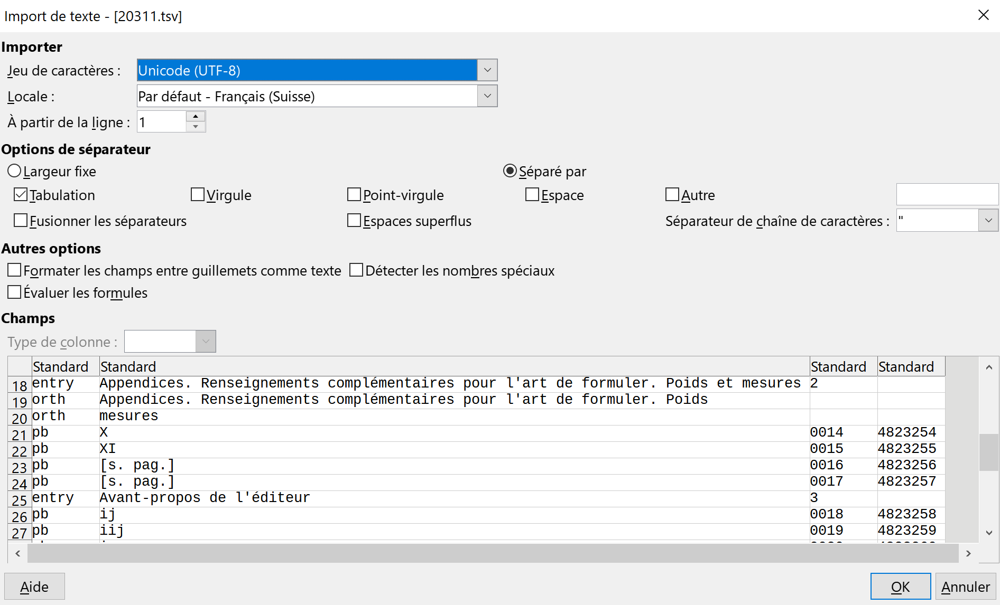
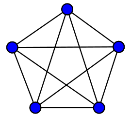

# BIU Santé / Médica / Métadictionnaire : données

Données importées dans la base de données MySQL. Deux sources

* [../anc_sql](../anc_sql), [../anc_tsv](../anc_tsv), données anciennes archivées.
* [medict-xml](https://github.com/biusante/medict-xml), pour les titres indexés finement, ne pas modifier ici, mais dans le XML

## tsv : tab separated values, utf-8.

 Fichier tabulaire unicode avec la tabulation pour séparateur de cellule (\\t), modifiable avec le tableur LibreOffice (mais surtout pas ~~Microsoft.Excel~~ qui sciemment décode mal l’unicode).

## “Événements”

Toutes les données à charger dans la base relationnelle sont dans un format tabulaire d’“événements”, au sens où toutes les lignes ne sont pas des données indépendantes, mais sont des sortes de commandes, produisant un contexte pour les lignes suivantes (ex: un saut de page est déclaré une fois pour toutes les entrées qui suivent, jusqu’au saut de page suivant). Ce format est réfléchi pour limiter les redondances, et faciliter la modification humaine. Les données sont chargées dans la base SQL par l’automate [Biusante\Medict\Insert](php/Biusante/Medict/Insert.php).

|commande | paramètre 1 | paramètre 2 | paramètre 3 |
|--- | --- | --- | --- |
|pb | 754 | 768 | 4823244 |
| | _n° page affiché (décimal, romain, etc…)_ | _“refimg”, numéro décimal séquentiel pour url, ex [?do=page&cote=37020d&p=**768**](https://www.biusante.parisdescartes.fr/histoire/medica/resultats/index.php?do=page&cote=37020d&p=768)_ | _identitiant livancpages de l’ancienne base_ |
|entry | Glycinium, Glycium, Béryllium | 1 | |
| | _vedettes (un ou plusieurs mot)_ | _nombre de sauts de pages de l’entrée, 0 = (p. 754), 1 = (p. 754-755), 5 = (p. 754-759)…_ | |
|orth | Glycinium |  | |
|orth | Glycium |  | |
|orth | Béryllium |  | |
| | _vedette dédoublonnée (si nécessaire)_ |  | |
|foreign | Glycium | deu | |
|foreign | glycion | eng | |
|foreign | glicio | ita | |
| | _traduction_ | _code langue 3 c._ | |
|term |	Catalyse ou	fermentation glycique | | |
| | _sous-entrée, ex: locution_ | | |
|clique |	Catalyse ou fermentation glycique \| Homérique | | |
| | _mots liés_ | | |

Le modèle pour les traductions et les mots liées résulte de longues discussions avec l’équipe scientifique.

Soit l’entrée « Glycinium, Glycium, Béryllium ».

Pour les traductions, il a été considéré que le lexicographe a établi une équivalence terminologique stricte, non seulement entre chaque vedette et chaque traduction 2 à 2 : [fra] glycinium <-> [deu] Glycium, [fra] béryllium <-> [deu] Glycium, [fra] glycinium <-> [eng] glycion… mais aussi entre les mots en langue étrangère entre eux :  [deu] Glycium <-> [eng] glycion <-> [ita] glicio <-> [deu] Glycium. En termes de théorie des graphes, ces _mots_ (forme graphique + langue) sont les nœuds d’un [graphe complet](https://fr.wikipedia.org/wiki/Graphe_complet) épuisant toutes les relations entre les nœuds. ([fra] glycinium, [fra] béryllium, [fra] glycinium, [deu] Glycium, [eng] glycion, [ita] glicio).

Pour les _mots liés_ (renvois, locutions…) un extrait de l’article [INSTINCT, _Littré Robin_ 13e éd., 1873, p. 806-807.](https://www.biusante.parisdescartes.fr/histoire/medica/resultats/index.php?do=page&cote=37020d&p=0820) permettra d’illustrer le modèle.

**INSTINCT.** s. m. […] — _Instincts altruistes_. V. ALTRUISME. […] — _Perversion morale des instincts_. V. FOLIE _héréditaire_.</sense>

~~~~
<entry xml:id="instinct">
  <form><orth>Instinct</orth>, s. m.</form>
  <sense>— <term>Instincts altruistes</term>. V. <ref target="altruisme">Altruisme</ref>.</sense>
  <sense>— <term>Perversion morale des instincts</term>. V. <xr><ref target="folie">Folie</ref> héréditaire</xr>.</sense>
</entry>
~~~~

| entry |	Instinct |
|--- | --- |
| term	| Instincts altruistes	|	
| clique |	Instincts altruistes \| Altruisme	|
| term |	Perversion morale des instincts	|
| clique |	Perversion morale des instincts \| Folie \| Folie héréditaire		|

_Instincts altruistes_ et _Perversion morale des instincts_ sont des sous-vedettes de l’article INSTINCT. Le balisage a permis d’en délimiter la portée avec l’_élément_ `<sense>`. Ceci est signifié par la commande `term`. _Folie héréditaire_ n’**est pas** une sous-vedette de l’article INSTINCT, mais un renvoi à une sous-vedette de l’article FOLIE. Il a été essayé de supposer que tous les renvois d’un article formaient une seule clique, il en résultait par exemple que _Altruisme_ était lié à _Folie_. Après expérience sur la totalité des données, il a été constaté que cela produisait beaucoup plus de bruit que de relations sémantiques. La commande _clique_ modélise les rapprochements sémantiques suivants (Instinct, Instincts altruistes, Altruisme) et (Instinct, Perversion morale des instincts, Folie, Folie héréditaire). _Instinct_ et _Altruisme_ sont liés (ainsi que _Instincts altruistes_), _Instinct_ et _Folie_ sont liés (ainsi que _Perversion morale des instincts_ et _Folie héréditaire_) ; mais pas ~~_Altruisme_ et _Folie_~~.
